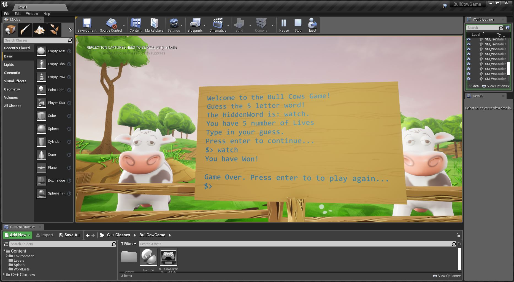
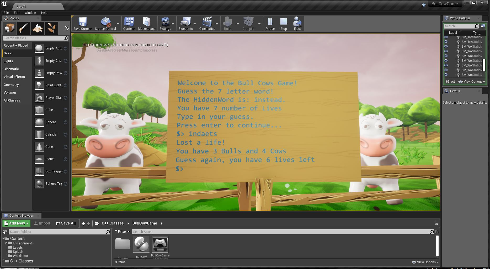
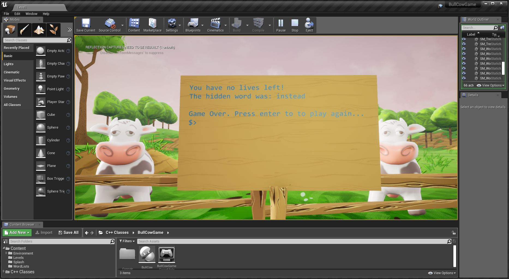

# Project: Bulls and Cows Game

Bulls &amp; Cows is a terminal game within Unreal Engine C++. Your task is to guess the hidden word correctly. If you guess the wrong word, you lose a life. You have a certain number of lives based on how many words are in the hidden word. For each guess you make, the game will tell you how many letters you got right (Bulls) and wrong (Cows). If you lose all your lives, you lose the game. If you guess the word correctly, you win the game.

**Figure 1:** Guess the Correct Word. You Win!

**Figure 2:** Guess the Wrong Word. You Lose a Life!

**Figure 3:** Guess the Wrong Word Too Many Times. You Lose!

**Note**: Hidden Word is a Debug Line in both images above. In the actual game, it will be omitted.

## Game Controls

Once you hit the play button in Unreal Engine, the game will start. The controls for interacting with the game include:

First you will `mouse click` on any section of the game displayed above. So, now you can interact with the game by pressing `tab`. When you press `tab`, it will allow you to access the wooden terminal, so you can enter your guesses for words. When you are finished typing in your guess, press `enter` and the terminal will display if you guessed the word correctly. If you win the game and want to play again, press `enter` again to play the game again. If you lose the game and you want to play again, press `enter` again.

- `Mouse Click`: indicate that you've entered the game
- `Tab`: press once and allows you to enter words on the wooden terminal
- `Enter`: submit your guessed word or play the game again after winning or losing

## How Does The Game Work?

This game is a word guessing game in which you guess the isogram. An isogram is any word that doesn't have any repeating letters. It limits our selection of words and also enables us to give a bull or a cow. What are those? A letter in a guess and in the right place is a "Bull". A letter in a guess and in the wrong place is a "Cow". If you guess a letter that isn't in our hidden word, then you won't get any bulls or cows.

## Mechanics of The Game

The hidden word is going to be pulled from a list of words. The game will let us know the number of lives we have. The player will make a guess. You will lose a life if you get it wrong. The game will display how many bulls and cows you got. If the correct word is guessed, then you won. If you do not correctly guess the word and your lives are gone, then the game is over.

## Example Playthrough

Hit Play in Unreal.

Our first word we are trying to guess is `instead`. The top line is added, so we know what we are supposed to be guessing. It is only there for debugging purposes. It is a good way to debug our code, so that we know what we are trying to guess is correct. Of course, the full game won't have that in place. So, we'll be guessing the `7` letter word and we'll have `7` lives. We can see the number of letters in the word we are trying to guess and the number of lives we have are linked. If we generate a new word, then the word we are guessing will change and the number of lives we have will change too. So, we can adjust the amount of lives we have based on the length of the word.

If we put in a word that is too short, the game will prompt the player and allow them to guess again without taking away one of their lives.

If we put in a `5` letter word that isn't an isogram, the game will prompt the player that they entered a word that isn't an isogram.

If we guess a word with the matching length of characters as the word we are trying to guess, but our guess doesn't match, the game will tell us the number of letters (`Bulls`) we got correct and the letters (`Cows`) we got incorrect. We will also lose a life for guessing the word incorrectly.

If we enter a word and all the characters in that word match the word we are trying to guess, then we win the game. For example, if we guess `instead`, then we win the game because that is the word we are trying to guess for this round.

Alternatively, if we have lost all our lives because we kept guessing the wrong word, the game will end and tell us what the correct word was.

## Resources

[Udemy: Unreal Engine C++ Developer Course](https://www.udemy.com/course/unrealcourse/)

- Section 3: Bulls & Cows (6 hours 49 minutes of video)